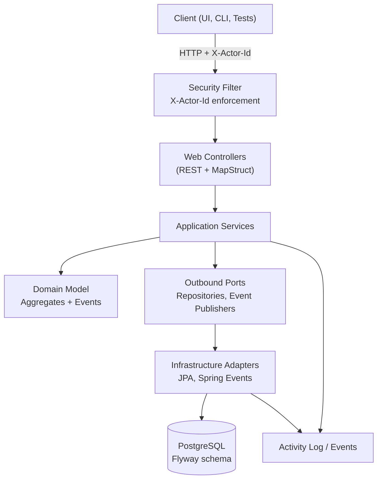

# Taskify

Taskify is a Spring Boot 3 demo application that showcases production-ready patterns for a team task management backend: layered architecture, security, observability, CI/CD, and documentation. It powers personas such as team members, team leads, and auditors with APIs for projects, tasks, comments, tags, and activity tracking.

## Architecture Snapshot
- Java 21, Spring Boot 3.5.x, layered per feature (`web`, `application`, `domain`, `infrastructure`).
- Persistence with PostgreSQL (Flyway migrations, Spring Data JPA).
- Security via header-based authentication (placeholder for future JWT integration).
- Observability via Actuator, Micrometer, structured logging.
- API documentation powered by springdoc OpenAPI (`docs/openapi.json`).

### System Overview


### HTTP Surface Snapshot
| Resource | Endpoints | Notes |
| --- | --- | --- |
| Tasks | `POST /api/tasks`, `GET /api/tasks?projectId=...`, `GET /api/tasks/{id}`, `PUT /api/tasks/{id}`, `PATCH /api/tasks/{id}/status`, `PATCH /api/tasks/{id}/assignee`, `POST/DELETE /api/tasks/{id}/tags/{tagId}` | Requires `X-Actor-Id`; emits ProblemDetail (HTTP 400/404/409) via `ApiErrorHandler` on validation/domain failures. |
| Projects | `POST /api/projects`, `GET /api/projects`, `GET /api/projects/{id}`, `PUT /api/projects/{id}`, `PATCH /api/projects/{id}/status`, `PATCH /api/projects/{id}/owner` | Owner reassignment validates user existence through `UserDirectory`. |
| Tags | `POST /api/tags`, `GET /api/tags` | Duplicate names return HTTP 400 with ProblemDetail. |
| Comments | `POST /api/tasks/{taskId}/comments`, `GET /api/tasks/{taskId}/comments`, `DELETE /api/tasks/{taskId}/comments/{commentId}` | Delete returns 404 when comment already removed. |
| Users | `GET /api/users`, `GET /api/users/{id}` | Read-only directory responses include role/status metadata. |
| Activity | `GET /api/activity?entityType=...&entityId=...`, `GET /api/activity?entityType=...&limit=N` | Provides entity-scoped or recent feed entries ordered by `occurredAt`. |

All controllers rely on the shared `ActorResolver` for authentication header parsing and on `ApiErrorHandler` for translating `IllegalArgumentException`/`IllegalStateException` into RFC 7807 ProblemDetail payloads.

### OpenAPI
- The canonical specification lives at `docs/openapi.json` (authored alongside the controllers). Update it whenever endpoints, request bodies, or responses change.
- `docs/openapi.html` embeds Swagger UI pointing at the local JSON for quick browsing—open the file directly in a browser or serve `docs/` via any static host.

See `docs/project-plan.md` and the ADRs in `docs/adr/` for the detailed roadmap and decisions.

## Prerequisites
- **JDK 21** – Install locally or use the helper tarball download steps below.
- **Maven Wrapper** – Provided via `./mvnw`, no global Maven install required.
- **Docker** (optional for now) – Needed once the local Postgres stack is introduced.

### Quick JDK 21 Setup
If you do not have a full JDK available, download one into the repository:

```bash
mkdir -p tools
curl -sSL -o tools/jdk21.tar.gz https://download.oracle.com/java/21/latest/jdk-21_linux-x64_bin.tar.gz
tar -xzf tools/jdk21.tar.gz -C tools
export JAVA_HOME="$(pwd)/tools/jdk-21.0.8"
export PATH="$JAVA_HOME/bin:$PATH"
```

Adjust the extracted directory name if a newer patch release is downloaded.

## Getting Started
```bash
# Format code (optional, but recommended before the first commit)
JAVA_HOME="$(pwd)/tools/jdk-21.0.8" ./mvnw spotless:apply

# Run the verification suite (includes tests, coverage, formatting check)
JAVA_HOME="$(pwd)/tools/jdk-21.0.8" ./mvnw verify
```

### Quick Smoke Test
1. Start the application (`./mvnw spring-boot:run`) or run the Docker image.
2. Create a sample project:
   ```bash
   curl -X POST http://localhost:8080/api/projects \
     -H 'Content-Type: application/json' \
     -H 'X-Actor-Id: 11111111-2222-3333-4444-555555555555' \
     -d '{"name":"Demo","description":"Sample project","ownerId":"11111111-2222-3333-4444-555555555555"}'
   ```
3. Create a task in that project using the returned project ID. Verify the response, then fetch the
   task list:
   ```bash
   curl -H 'X-Actor-Id: 11111111-2222-3333-4444-555555555555' \
     "http://localhost:8080/api/tasks?projectId=<project-id>"
   ```
4. Inspect recent activity:
   ```bash
   curl -H 'X-Actor-Id: 11111111-2222-3333-4444-555555555555' \
     "http://localhost:8080/api/activity?entityType=TASK&entityId=<task-id>"
   ```
   Each mutating action records an entry with a deterministic payload.

## Container Image
The repository ships with a multi-stage `Dockerfile` that builds the Spring Boot fat jar and publishes a slim runtime image (Temurin JRE 21).

```bash
# Build (skips tests inside the container for speed)
docker build -t taskify:latest .

# Run with an in-memory database profile
docker run --rm -p 8080:8080 \
  -e SPRING_PROFILES_ACTIVE=local \
  taskify:latest
```

Images honour `JAVA_OPTS`, letting you add flags (e.g. `-Xms256m -Xmx256m`) without editing the entrypoint.

On merges to `main`, CI pushes an image to GitHub Container Registry under `ghcr.io/<owner>/<repo>` with branch- and SHA-based tags. To pull the latest mainline build:

```bash
docker login ghcr.io -u <github-username> -p <github-token>
docker pull ghcr.io/<owner>/<repo>:main
```

### Layering Strategy
`src/main/resources/BOOT-INF/layers.idx` customises the Spring Boot layering metadata so frequently changing resources (`static/`, configuration files) live in their own layers. That enables Docker layer caching to reuse the heavy dependency layer when iterating on code while still keeping configuration overrides inexpensive.

## Local Infrastructure
- Copy `.env.sample` to `.env` and adjust credentials if necessary.
- Start the local Postgres + pgAdmin stack:

```bash
docker compose -f docker-compose.local.yml --env-file .env up -d
```

- Access pgAdmin at `http://localhost:5050` using the credentials defined in `.env`.
- Apply Flyway migrations automatically by starting the Spring Boot application (`./mvnw spring-boot:run`) or running `./mvnw flyway:migrate` once database credentials are reachable.

### Sample Data Seeder
Need a realistic dataset for demos or manual testing? A Python helper script can populate the API via public endpoints:

1. **Provision at least one user** – the API does not expose user creation. Insert rows manually (pgAdmin or `psql`). Example using the local Docker container:
   ```bash
   docker exec taskify-postgres psql -U taskify -d taskify -c \
     "INSERT INTO users (id, username, email, password_hash, role, status) \
      VALUES ('11111111-2222-3333-4444-555555555555','demo.owner','owner@example.com','noop','ADMIN','ACTIVE') \
      ON CONFLICT (id) DO NOTHING;"
   docker exec taskify-postgres psql -U taskify -d taskify -c \
     "INSERT INTO users (id, username, email, password_hash, role, status) \
      VALUES ('22222222-3333-4444-5555-666666666666','demo.collab','collab@example.com','noop','TEAM_MEMBER','ACTIVE') \
      ON CONFLICT (id) DO NOTHING;"
   ```
   Confirm with:
   ```bash
   curl -s -H "X-Actor-Id: 11111111-2222-3333-4444-555555555555" \
     http://localhost:8081/api/users | jq
   ```
2. **Install dependencies** – requires Python 3.11+ and `requests`:
   ```bash
   python3 -m pip install --user requests
   ```
3. **Seed data**:
   ```bash
   python3 scripts/sample_data_generator.py \
     --base-url http://localhost:8081 \
     --actor-id 11111111-2222-3333-4444-555555555555 \
     --owner-ids 11111111-2222-3333-4444-555555555555,22222222-3333-4444-5555-666666666666 \
     --run create
   ```
   The script records created resource IDs in `.taskify-seed-state.json` and prints a summary.
4. **Cleanup later** (optional):
   ```bash
   python3 scripts/sample_data_generator.py --run cleanup
   ```
   Cleanup relies solely on REST endpoints: comments deleted, tag attachments removed, tasks/projects transitioned to `CANCELLED`.

Tip: After seeding, open the UI at `http://localhost:8081/` and run the Health tab diagnostics to verify each endpoint.

## Development Workflow
1. Create a feature branch from `main`.
2. Implement the change, updating docs/ADRs when architecture decisions shift.
3. Run `./mvnw verify` (with `JAVA_HOME` pointing to your JDK 21 if necessary).
4. Open a pull request describing the change and test evidence.

### Git Hooks
A helper hook is provided under `scripts/git-hooks/pre-commit`. Link it into your local `.git/hooks` directory or integrate with your preferred hook manager so that formatting and tests run before each commit.

```bash
ln -s ../../scripts/git-hooks/pre-commit .git/hooks/pre-commit
chmod +x scripts/git-hooks/pre-commit
```

## Formatting & Quality Gates
- Spotless + Google Java Format enforce style (`./mvnw spotless:apply` to fix).
- JaCoCo enforces a minimum 70% instruction coverage per class during `./mvnw verify`; add unit tests or adjust exclusions before merging if the gate fails.
- Additional linters and security scanners will be wired into CI (see `docs/project-plan.md` Milestone 8).

## Configuration
- Configuration profiles will live in `src/main/resources/application*.yml`.
- Secret material belongs in environment variables. A `.env.sample` file will document required variables.

## Documentation
- **Project Plan** – `docs/project-plan.md`
- **Product Brief** – `docs/product-brief.md`
- **Glossary** – `docs/glossary.md`
- **Architecture Overview** – `docs/architecture.md`
- **API Reference** – `docs/api-reference.md`
- **Deployment Guide** – `docs/deployment-guide.md`
- **Activity Log Guidelines** – `docs/activity-log.md`
- **Architecture Decision Records** – `docs/adr/`
- **Status** – `docs/status.md`

Contributions are welcome—see `CONTRIBUTING.md` for guidance.
