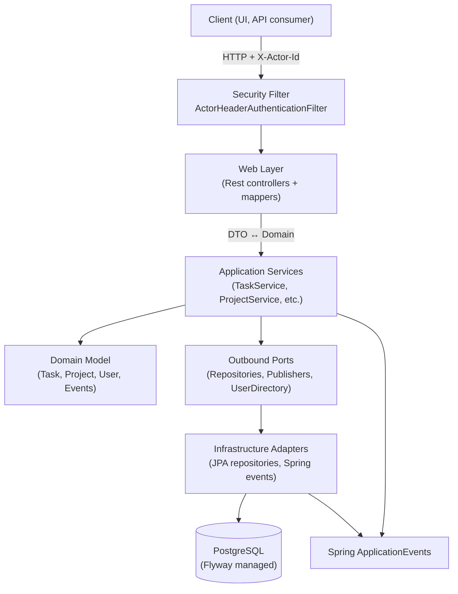

# Architecture Overview

Taskify follows a classic hexagonal architecture that separates the HTTP layer, application
services, domain model, and infrastructure adapters. The goal is to keep business rules independent
from delivery mechanisms and persistence concerns.

## Layer Breakdown

### Web Layer (`src/main/java/com/example/taskify/web`)
- Spring MVC controllers expose REST endpoints for tasks, projects, tags, users, comments, and
  activity feeds.
- MapStruct mappers convert between domain models and DTO records.
- `ApiErrorHandler` translates exceptions into RFC‑7807 `ProblemDetail` payloads.
- `ActorResolver` centralises extraction of the authenticated actor ID from the Spring Security
  context.

### Security (`src/main/java/com/example/taskify/config/security`)
- `ActorHeaderAuthenticationFilter` enforces the `X-Actor-Id` header on `/api/**` endpoints and
  places the UUID principal into the security context.
- `SecurityConfig` wires the stateless filter chain for API routes while keeping documentation routes
  public.

### Application Layer (`src/main/java/com/example/taskify/application`)
- Services orchestrate use cases such as task lifecycle management, project updates, tagging, comment
  workflows, and activity recording.
- Outbound ports (`application.port.out`) define repository and publisher contracts.
- `ActivityService` and `ActivityQueryService` act as the façade for recording and retrieving audit
  entries.
- UUID and clock providers are injected to make operations deterministic in tests.

### Domain Layer (`src/main/java/com/example/taskify/domain`)
- Rich aggregates model Tasks, Projects, Users, Tags, Comments, and Activity Entries.
- Domain events (`TaskStatusChangedEvent`, `ProjectStatusChangedEvent`, etc.) capture important state
  transitions and are drained by the application layer.
- Business rules such as status transitions, assignment invariants, and scheduling checks live in the
  domain classes.

### Infrastructure Layer (`src/main/java/com/example/taskify/infrastructure`)
- Persistence adapters implement outbound ports using Spring Data JPA entities, mappers, and
  repositories.
- `SpringDomainEventPublisher` bridges domain events to Spring's `ApplicationEventPublisher`.
- JPA entities inherit from `AuditableJpaEntity`, mapping audit metadata produced by the domain
  aggregates.
- Testcontainers-backed integration tests live under `src/test/java/com/example/taskify/infrastructure`
  and share `PostgresIntegrationTest` to bootstrap PostgreSQL and Flyway.

### Configuration (`src/main/java/com/example/taskify/config`)
- `PersistenceConfig` configures auditing, UUID suppliers, clock bean, and JPA naming strategy.
- `OpenApiConfig` registers the OpenAPI metadata and models the `X-Actor-Id` security scheme.
- `TaskifyPropertiesConfiguration` binds custom datasource properties for schema-aware operations.

## Cross-Cutting Concerns

- **Activity Logging**: All mutating services call `ActivityService` with typed payloads described in
  `docs/activity-log.md`. Retrieval is handled by `ActivityQueryService` and exposed via the
  `ActivityController`.
- **Validation**: Controllers use Jakarta Bean Validation annotations on request records and rely on
  service-level guards for additional invariants.
- **Testing Strategy**: Unit tests cover domain logic and service behaviour with Mockito. Integration
  tests exercise infrastructure adapters against Testcontainers Postgres and MockMvc for web
  endpoints. JaCoCo enforces a 70% instruction coverage per class (excluding generated mapper
  implementations and the Spring Boot launcher).

## Build & Runtime Flow

1. Clients send authenticated requests with `X-Actor-Id`.
2. The security filter creates an authenticated principal and delegates to controllers.
3. Controllers validate requests, translate DTOs, and call application services.
4. Application services enforce business rules, update domain aggregates, and persist changes through
   outbound ports.
5. Infrastructure adapters store data in PostgreSQL, emit domain events, and return domain objects.
6. Activity logging records audit events for later retrieval.
7. Responses are mapped back to DTOs and rendered to clients as JSON.

