# Architecture Overview

Taskify follows a classic hexagonal architecture that separates the HTTP layer, application
services, domain model, and infrastructure adapters. The goal is to keep business rules independent
from delivery mechanisms and persistence concerns.

## Technology Stack
- **Language & Build**: Java 21, Maven Wrapper
- **Frameworks**: Spring Boot 3.5.3 (Web, Validation, Security, Actuator)
- **Persistence**: PostgreSQL 16+, Flyway migrations, Spring Data JPA
- **Mapping**: MapStruct 1.5.5.Final
- **API Tooling**: springdoc-openapi 2.6.0
- **Testing**: JUnit 5, Mockito, Testcontainers (PostgreSQL 16.4)

## System Diagram

```mermaid
graph TD
    Client["Clients (UI, API consumers, tests)"]
    Filter["ActorHeaderAuthenticationFilter\n(X-Actor-Id enforcement)"]
    Web["Web Layer\nREST controllers + MapStruct mappers + ApiErrorHandler"]
    App["Application Services\nTasks, Projects, Tags, Comments, Users, Activity"]
    Domain["Domain Layer\nAggregates, Value Objects, Domain events"]
    Ports["Outbound Ports\nRepositories, Event Publishers, UserDirectory"]
    Infra["Infrastructure Adapters\nSpring Data JPA, DatabaseUserDirectory, Activity Log, Event bridge"]
    DB[("PostgreSQL\nFlyway-managed schema")]
    Events["Spring ApplicationEvents"]

    Client -->|HTTP + X-Actor-Id| Filter --> Web --> App --> Domain
    Domain -->|Domain events| App
    App --> Ports --> Infra --> DB
    App --> Events
    Infra --> Events
```

### Component Responsibility Matrix

| Package / Module | Responsibility | Key Types |
| --- | --- | --- |
| `web` | Accept/validate HTTP requests, map DTOs, return JSON responses. | `TaskController`, `ApiErrorHandler`, `TaskMapper` |
| `application.service` | Orchestrate use cases, enforce transactional boundaries, emit domain events/activity logs. | `TaskService`, `ProjectService`, `ActivityService` |
| `application.port.out` | Contracts for persistence, directory lookups, and event publishing. | `TaskRepository`, `ProjectRepository`, `TaskTagRepository`, `ActivityLogRepository`, `UserDirectory`, `TaskEventPublisher`, `ProjectEventPublisher` |
| `domain` | Domain model with invariants, value objects, and domain events. | `Task`, `Project`, `TaskStatusChangedEvent` |
| `infrastructure.persistence.jpa` | Spring Data JPA entities, mappers, and repositories implementing outbound ports. | `TaskJpaEntity`, `ActivityLogRepositoryAdapter`, `DatabaseUserDirectory` |
| `infrastructure.events` | Bridges domain events to Spring's event bus. | `SpringDomainEventPublisher` |
| `config` | Spring configuration, beans, and OpenAPI metadata. | `PersistenceConfig`, `SecurityConfig`, `OpenApiConfig`, `TaskifyPropertiesConfiguration` |

## Layer Breakdown

### Web Layer (`src/main/java/com/example/taskify/web`)
- Spring MVC controllers expose REST endpoints for tasks, projects, tags, users, comments, and
  activity feeds.
- MapStruct mappers convert between domain models and DTO records.
- `ApiErrorHandler` translates domain-specific exceptions into RFC‑7807 `ProblemDetail` payloads (`IllegalArgumentException` → 400, `ResourceNotFoundException` → 404, `IllegalStateException` → 409).
- `ActorResolver` centralises extraction of the authenticated actor ID from the Spring Security
  context.
- Controllers are intentionally thin: they validate requests, invoke a single application service
  method, and translate domain responses back to DTOs.

### Security (`src/main/java/com/example/taskify/config/security`)
- `ActorHeaderAuthenticationFilter` enforces the `X-Actor-Id` header on `/api/**` endpoints and
  places the UUID principal into the security context.
- `SecurityConfig` wires the stateless filter chain for API routes while keeping documentation routes
  public.
- `SecurityAuditorAware` bridges the current principal into Spring Data's auditing infrastructure so
  the persistence layer can populate `createdBy`/`updatedBy` columns automatically.

### Application Layer (`src/main/java/com/example/taskify/application`)
- Services orchestrate use cases such as task lifecycle management, project updates, tagging, comment
  workflows, and activity recording.
- Outbound ports (`application.port.out`) define repository and publisher contracts.
- `ActivityService` and `ActivityQueryService` act as the façade for recording and retrieving audit
  entries.
- UUID and clock providers are injected to make operations deterministic in tests.
- Each service method provides the transaction boundary via `@Transactional` annotations, ensuring
  domain changes and activity log entries commit atomically.
- Domain events emitted from aggregates are drained by services and forwarded to the Spring event bus
  through `SpringDomainEventPublisher`, paving the way for asynchronous listeners.

### Domain Layer (`src/main/java/com/example/taskify/domain`)
- Rich aggregates model Tasks, Projects, Users, Tags, Comments, and Activity Entries.
- Domain events (`TaskStatusChangedEvent`, `ProjectStatusChangedEvent`, etc.) capture important state
  transitions and are drained by the application layer.
- Business rules such as status transitions, assignment invariants, and scheduling checks live in the
  domain classes.
- Aggregates are immutable from the outside; state transitions occur through intent-revealing
  methods (`changeStatus`, `assignTo`, `updateDetails`, etc.) that enforce invariants and produce
  events when meaningful transitions occur.

### Infrastructure Layer (`src/main/java/com/example/taskify/infrastructure`)
- Persistence adapters implement outbound ports using Spring Data JPA entities, mappers, and
  repositories (`TaskRepositoryAdapter`, `TaskTagRepositoryAdapter`, `ActivityLogRepositoryAdapter`,
  `DatabaseUserDirectory`, etc.).
- `SpringDomainEventPublisher` bridges domain events to Spring's `ApplicationEventPublisher`, keeping
  consumers decoupled from the core domain.
- JPA entities inherit from `AuditableJpaEntity`, mapping audit metadata produced by the domain
  aggregates.
- Testcontainers-backed integration tests live under `src/test/java/com/example/taskify/infrastructure`
  and share `PostgresIntegrationTest` to bootstrap PostgreSQL and Flyway.
- Adapter tests assert both persistence behaviour (e.g., join-table semantics for task+tag
  relationships) and mapping fidelity between JPA entities and domain aggregates.

### Configuration (`src/main/java/com/example/taskify/config`)
- `PersistenceConfig` configures auditing, UUID suppliers, clock bean, and JPA naming strategy.
- `OpenApiConfig` registers the OpenAPI metadata and models the `X-Actor-Id` security scheme.
- `TaskifyPropertiesConfiguration` binds custom datasource properties for schema-aware operations.

## Cross-Cutting Concerns

- **Activity Logging**: All mutating services call `ActivityService` with typed payloads described in
  `docs/activity-log.md`. Retrieval is handled by `ActivityQueryService` and exposed via the
  `ActivityController`.
- **Validation**: Controllers use Jakarta Bean Validation annotations on request records and rely on
  service-level guards for additional invariants.
- **Testing Strategy**: Unit tests cover domain logic and service behaviour with Mockito. Integration
  tests exercise infrastructure adapters against Testcontainers Postgres and MockMvc for web
  endpoints. JaCoCo enforces a 70% instruction coverage per class (excluding generated mapper
  implementations and the Spring Boot launcher).

## Build & Runtime Flow

1. Clients send authenticated requests with `X-Actor-Id`.
2. The security filter creates an authenticated principal and delegates to controllers.
3. Controllers validate requests, translate DTOs, and call application services.
4. Application services enforce business rules, update domain aggregates, and persist changes through
   outbound ports.
5. Infrastructure adapters store data in PostgreSQL, emit domain events, and return domain objects.
6. Activity logging records audit events for later retrieval.
7. Responses are mapped back to DTOs and rendered to clients as JSON.

### Activity Logging Pipeline

- Mutating service operations build deterministic payload maps using `LinkedHashMap` to guarantee key
  ordering and shape.
- `ActivityService` assigns IDs/timestamps and persists entries through `ActivityLogRepository`.
- Retrieval requests delegate to `ActivityQueryService`, which offers entity-scoped and recent feed
  lookups with optional limits to support UI pagination.

### Data Persistence & Migrations

- Canonical schema lives in Flyway migration `V1__init_schema.sql` and includes auditing columns for
  every table, JSONB storage for activity payloads, and indexes for common query paths (project/task
  filtering, occurredAt ordering).
- JPA entities mirror the schema and intentionally avoid bidirectional relationships to keep the
  domain model decoupled from persistence-specific constructs.
- Integration tests validate repository behaviour against real PostgreSQL via Testcontainers, ensuring
  migrations and entities stay aligned.
